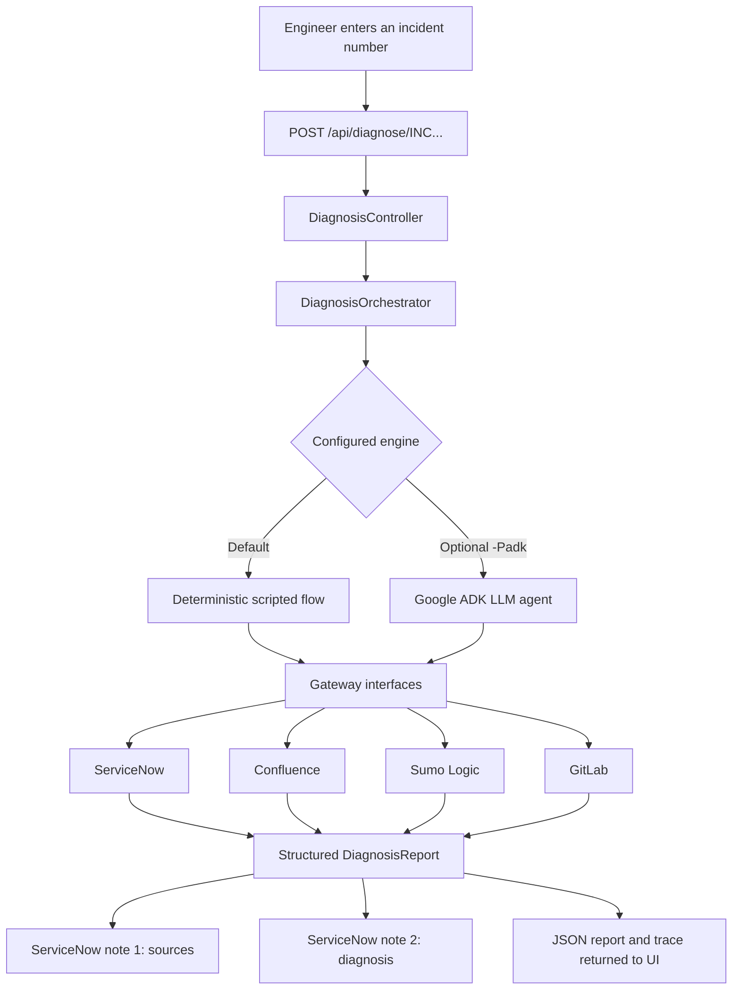

# TriageMate application review

**Review date:** 28 July 2026  
**Branch reviewed:** `feature/init-version`  
**Commit reviewed:** `ddc06ae` (`init`)  
**Concept reviewed:** [Incident Triage Copilot — Pitch](https://claude.ai/code/artifact/6772a5e5-838c-4310-be1f-c880aab8dd89)

## Executive summary

TriageMate is a working hackathon proof of concept for giving a new ServiceNow
incident an evidence-backed first-pass diagnosis. It has a good central idea:
reduce the time engineers spend discovering what an incident means and who owns it,
while keeping the output advisory and auditable.

The active application is a local Java 21 / Spring Boot service under [`app/`](../app/).
It:

1. accepts an incident number through a web page or HTTP endpoint;
2. reads incident information through a ServiceNow gateway;
3. gathers evidence through ServiceNow, Confluence, Sumo Logic, and GitLab gateways;
4. builds a structured diagnosis containing the likely system, support team,
   confidence, evidence, missing information, and next action;
5. writes two advisory notes to ServiceNow—sources first, diagnosis second; and
6. returns the report and an execution trace to the web UI.

The most important qualification is that the default demo is **not currently an
autonomous agent**. The default `deterministic` engine follows a fixed sequence,
consults every source, uses a curated payment-incident fixture, and assembles a
mostly hard-coded conclusion. An optional Google ADK engine gives an LLM access to
the same tools, but its automated test proves only one tool round trip against a
fake OpenAI-compatible server; it does not yet prove a complete live investigation
against the enterprise model and real data sources.

Likewise, creation of a ServiceNow incident does **not** currently trigger the
application automatically. The working trigger is the UI or
`POST /api/diagnose/{incidentNumber}`. Automatic ServiceNow triggering is explicitly
deferred in the project documentation.

The best honest description for the hackathon is:

> TriageMate is a working, safe-to-demo vertical slice of an incident-triage
> copilot. Its workflow, evidence model, connectors, report, trace, UI, and
> ServiceNow write-back are implemented. The default demo uses a curated,
> deterministic scenario for reliability; the ADK-based agent path is implemented
> and integration-tested at the tool-calling level, with live enterprise validation
> still to complete.

That is still a strong hackathon story. The log-to-code correlation—finding the
source line that emitted an observed production error—is the most distinctive part
of the demo.

## Repository orientation

The repository contains two generations of the application:

| Area | Status | Purpose |
|---|---|---|
| [`app/`](../app/) | **Active** | Spring Boot application with deterministic and optional Google ADK engines |
| [`docs/design-java/`](design-java/) | **Active design** | Java concepts J1–J8 |
| [`docs/discovery/servicenow-triage-java/`](discovery/servicenow-triage-java/) | **Active discovery** | Decisions behind the Java/ADK implementation |
| [`manifest.yml`](../manifest.yml), [`src/`](../src/), [`test/`](../test/) | **Paused** | Earlier Atlassian Forge/Rovo JavaScript prototype |
| [`docs/design/`](design/) | **Paused** | Earlier Rovo/Forge design |

The pivot is explained in [`PIVOT.md`](../PIVOT.md). This distinction should be made
more prominent because a new contributor could reasonably assume that the
root-level `package.json`, `manifest.yml`, and `src/index.js` are the running
application.

There is also a naming inconsistency. The repository and UI call the product
“Incident Triage Copilot,” while the team calls it “TriageMate.” A clear combined
name—**TriageMate: Incident Triage Copilot**—would preserve the explanation while
giving the hackathon entry a memorable identity.

## What the application does, in plain English

### Runtime overview



### 1. The run is triggered

The web page calls:

```http
POST /api/diagnose/{incidentNumber}
```

[`DiagnosisController`](../app/src/main/java/com/company/triage/api/DiagnosisController.java)
passes the incident number directly to
[`DiagnosisOrchestrator`](../app/src/main/java/com/company/triage/orchestration/DiagnosisOrchestrator.java).

This is a **manual trigger today**. The code is suitable for a future ServiceNow
webhook, but the webhook/Flow Designer integration is not built. The decision and
proposed production route are documented in
[`servicenow-auto-trigger/4-decide/decision.md`](discovery/servicenow-auto-trigger/4-decide/decision.md).

### 2. The orchestrator selects the “brain”

The orchestrator delegates the investigation to one implementation of
[`DiagnosisEngine`](../app/src/main/java/com/company/triage/orchestration/DiagnosisEngine.java):

| Engine | Default? | What it really does |
|---|---:|---|
| `DeterministicDiagnosisEngine` | Yes | Runs a fixed seven-step Java workflow over a curated payment incident. No LLM is involved. |
| `AdkDiagnosisEngine` | No | Lets a Google ADK `LlmAgent` choose among six tools and produce the report as JSON. Requires the Maven `adk` profile and an OpenAI-compatible model endpoint. |

This split is sensible for a hackathon: the deterministic path makes the demo
repeatable, while the ADK path provides a route to genuine agentic behaviour.

### 3. The default engine investigates the incident

The default engine in
[`DeterministicDiagnosisEngine.java`](../app/src/main/java/com/company/triage/orchestration/DeterministicDiagnosisEngine.java)
performs these steps:

1. **Read the incident from ServiceNow.** It obtains the description, environment,
   configuration item, opened time, current team, and related context.
2. **Extract an order ID.** A regular expression looks for an identifier such as
   `INC-ORD-4471` in the short description and description.
3. **Find similar incidents and ownership.** ServiceNow is searched for resolved
   incidents and CMDB support ownership. These are used as routing evidence.
4. **Search Confluence.** The default engine always searches for the fixed phrase
   `checkout order payment reconcile 500`.
5. **Search Sumo Logic.** It always searches `prod/payment`, within ten minutes
   before and after the incident time, with a 20-result limit. It selects the first
   `ERROR` message and extracts a capitalised error token such as
   `PAYMENT_RECONCILE_MISMATCH`.
6. **Search GitLab.** If an error token was found, it searches the fixed
   `order-payments/payment-service` project and cites the matching source file and
   line.
7. **Build the report.** It produces fixed Payment Service and Order Portal
   candidates, a payment support assignment, an explanation, missing information,
   and a recommended next check.

This is a convincing execution of the seeded scenario, but it is better understood
as an executable demo script than a general decision engine.

### 4. The optional ADK engine investigates with tools

[`AdkDiagnosisEngine.java`](../app/src/main/adk/java/com/company/triage/agent/AdkDiagnosisEngine.java)
creates one Google ADK `LlmAgent`. Its prompt tells the model to:

1. read the incident;
2. clarify the symptom;
3. inspect similar incidents and ownership;
4. optionally search Confluence;
5. run one bounded log search after discovering an application and identifier;
6. search code only after finding a concrete log token; and
7. output only a JSON diagnosis.

[`TriageTools.java`](../app/src/main/adk/java/com/company/triage/agent/TriageTools.java)
exposes six functions backed by the same gateways:

- `get_incident`
- `find_similar_incidents`
- `find_ownership`
- `search_confluence`
- `search_logs`
- `search_code`

The application limits the number of tool and LLM calls. Sumo source categories are
allowlisted. This is the path that most closely matches the pitch’s “it decides what
to consult” description.

The implementation is less constrained than its design documents currently claim:
it uses one agent with access to all tools rather than a phased `SequentialAgent`,
does not enforce tool order in code, and does not validate or repair the final report
beyond deserialising its JSON.

### 5. Gateways hide mock-versus-real integrations

Each system has a Java interface with mock and real implementations. Configuration
in [`application.yml`](../app/src/main/resources/application.yml) can switch each
connector independently:

```yaml
triage:
  connectors:
    servicenow: mock
    confluence: mock
    sumo: mock
    gitlab: mock
```

This is a strong architectural choice because the orchestration code does not care
whether the data came from fixtures or a live API.

| Source | Information used | Current default | Real implementation |
|---|---|---|---|
| ServiceNow | Current incident, similar resolved incidents, CMDB ownership; also receives the notes | Curated `INC0012345` story | REST Table API |
| Confluence | Runbooks and known errors | One payment-reconciliation article | CQL content search |
| Sumo Logic | A narrow incident log window | Four seeded log messages | Search Job API |
| GitLab | Source line that emits the error token | `payment_service.py:44` | Project blob search API |

### 6. A structured report is created

[`DiagnosisReport.java`](../app/src/main/java/com/company/triage/model/DiagnosisReport.java)
is the shared contract between the engines, UI, and ServiceNow notes. It carries:

- the clarified symptom and affected function;
- incident identifiers;
- ranked candidate systems;
- a suggested support group;
- evidence with source and link fields;
- contradicting evidence;
- missing information;
- a recommended next action;
- overall confidence; and
- an `advisory` flag.

Using one structured object as the “spine” of the application is a good decision.
It is much easier to test and evolve than asking an LLM to write an unstructured
comment directly.

### 7. Two notes are written back

After diagnosis, the orchestrator automatically asks the ServiceNow gateway to add:

1. **Sources consulted**—all evidence and links; then
2. **First-pass diagnosis**—the likely systems, team, confidence, missing
   information, and next check.

The application does not contain methods for reassigning, closing, reprioritising,
or remediating incidents. That keeps the intended action surface small.

In the default mock profile, “writing” means logging and retaining the notes in
memory. In the `snow-live` or `real` profile, the real ServiceNow gateway performs
REST `PATCH` requests.

### 8. The UI renders the result and trace

The single-page UI in
[`static/index.html`](../app/src/main/resources/static/index.html) shows:

- the clarified diagnosis;
- candidate systems and confidence bars;
- suggested assignment;
- evidence;
- contradictions and missing information;
- recommended next action;
- a preview of the two notes; and
- the execution trace.

This is well aligned with a live presentation because it makes otherwise invisible
tool calls visible.

## Concept versus current implementation

| Pitched workflow | Current implementation | Assessment |
|---|---|---|
| An incident is created and triggers TriageMate | User enters the number in the UI or calls the endpoint. Automatic ServiceNow triggering is deferred. | **Partial** |
| TriageMate fetches the incident from ServiceNow | Implemented through mock and real gateways. | **Implemented** |
| A decision engine chooses whether to use Confluence, Sumo, or GitLab | The default engine always calls all three. The ADK prompt permits choice, but the live enterprise flow is not yet proven. | **Partial** |
| It analyses the evidence and identifies the real issue | The default payment analysis and log-to-code link work for the seeded scenario; much of the conclusion is hard-coded. | **Implemented for one fixture** |
| It identifies the likely cause | It gives an advisory hypothesis and next check, which is safer wording than claiming a root cause. | **Implemented** |
| It identifies the likely support team | Implemented using CMDB/similar-incident evidence, but the real similarity search is currently very basic. | **Implemented, early quality** |
| It cites evidence | Implemented in the report and note text. Some “links” are identifiers or relative paths rather than usable URLs. | **Mostly implemented** |
| It writes findings to the incident | Implemented as two notes; the real connector can update a dev incident. | **Implemented, needs safety hardening** |
| It never acts on the incident | There are no assignment/state methods, but the configured ServiceNow field is not code-whitelisted to notes only. | **Intent implemented; enforcement incomplete** |

## What is already good

### 1. The problem and value proposition are clear

“The engineer does not start from zero” is easy to understand and directly tied to
incident response friction: vague tickets, unclear ownership, and assignment
bouncing.

### 2. The report is advisory and evidence-first

The report includes uncertainty, conflicting evidence, missing information, and a
next check. This is a much more credible use of AI than claiming automatic root-cause
analysis.

### 3. The two-note design is effective

Putting sources before interpretation makes the result easy to audit and gives the
engineer a quick path to challenge the conclusion.

### 4. The gateway architecture is clean

Narrow interfaces and independently switchable mock/real connectors are ideal for a
hackathon and provide a reasonable foundation for later production work.

### 5. The deterministic fallback is excellent demo insurance

The curated fixture is coherent across the incident, runbook, logs, and source code.
The presentation can succeed without network access, credentials, or model
availability.

### 6. Log-to-code correlation is memorable

Connecting `PAYMENT_RECONCILE_MISMATCH` in Sumo to
`payment_service.py:44` in GitLab creates a tangible “detective” moment that is
stronger than a generic AI summary.

### 7. There is a useful observability story

Returning the report and trace makes the agent’s work inspectable. Even though the
trace needs strengthening, surfacing it in the UI is the correct product instinct.

### 8. The current automated tests pass

Verification performed during this review:

- `mvn test`: **3 tests passed**
- `mvn -Padk test`: **5 tests passed**

The ADK build produced deprecation and generated-schema warnings for Java time
types, but it compiled and passed.

## Main review findings

### Critical before writing to a real ticket

#### 1. A real incident can receive evidence from the wrong fixture

The recommended `snow-live` combination uses real ServiceNow with mock Confluence,
Sumo, and GitLab. The deterministic engine also contains fixed payment searches and
fixed conclusions. As a result, almost any real incident number can receive a
payment-reconciliation diagnosis backed by the seeded `INC-ORD-4471` evidence.

For the hackathon, use only a dedicated synthetic ServiceNow incident whose content
matches the fixture. Add an explicit demo-mode guard that refuses any other incident,
for example a configured incident allowlist or a required `u_triage_demo=true` field.
Do not demonstrate this against an arbitrary dev ticket.

#### 2. The diagnosis endpoint has no authentication or trigger secret

Anyone who can reach the application can invoke the endpoint. In a real-ServiceNow
profile, that request causes two external writes. The server also has no configured
loopback-only address.

For a local demo, bind to `127.0.0.1`. For any webhook or shared environment, require
an authenticated ServiceNow call or at least the already-designed
`X-Triage-Secret`, add replay protection, and rate-limit the endpoint.

#### 3. “Comments only” is not fully enforced

`triage.servicenow.write-field` is inserted into the PATCH body without validation.
Although documentation says it may be only `work_notes` or `comments`, the code does
not enforce that set.

Replace the free-form string with a validated enum and fail startup for any other
value. The ServiceNow account should also lack permission to update assignment,
state, and priority fields.

#### 4. Real write-back is not idempotent

The `ServiceNowGateway` contract says implementations must skip an identical AI
note. The mock attempts this, but `RealServiceNowGateway` does not read existing
notes or use a run/idempotency key. A webhook retry or presenter double-click can
create duplicate notes. If the first note succeeds and the second fails, the ticket
is left with a partial result.

Give each run a stable ID derived from incident number plus incident update version,
include it in both notes, detect completed/partial runs, and make retries reconcile
rather than append blindly.

### Important capability gaps

#### 5. The default “decision engine” does not make source decisions

It always calls ServiceNow similarity/ownership, Confluence, Sumo, and GitLab when
an error token exists. Search terms, scope, repository, candidate systems,
confidence values, and much of the narrative are hard-coded.

This is acceptable as a demo mode, but the UI and presentation should label it
**Scripted fixture mode**. Show an explicit engine badge so judges do not mistake it
for the live agent.

#### 6. Automatic incident-created triggering is not implemented

The endpoint is ready, but there is no ServiceNow Flow Designer flow, Business Rule,
MID Server route, or event queue in the application. The deck’s “as soon as the
ticket arrives” language describes the target state.

For the hackathon, either say “triggered here manually because the cloud dev
instance cannot reach the corporate laptop” or implement the trigger only if the
network route and authentication can be demonstrated reliably.

#### 7. Degraded-source behaviour is inconsistent

The design says a failed source should be omitted and clearly marked degraded.
Confluence silently converts every exception into an empty result; the other real
connectors generally throw and abort the whole run. The deterministic engine has no
per-source error isolation or wall-clock timeout.

Return a typed source result such as `USED`, `SKIPPED`, `NO_RESULTS`, or `FAILED`,
including safe error metadata. Let optional sources fail independently, but treat
the initial ServiceNow read as required.

#### 8. The report can cite evidence that was never retrieved

The deterministic candidate and assignment `evidenceRefs` are fixed. If Confluence,
Sumo, GitLab, or CMDB returns no data, the report may still refer to IDs such as
`e-code`, `e-kb-KB001234`, or `e-cmdb`.

Add a report validator before write-back:

- every evidence reference must resolve;
- confidence must be between 0 and 1;
- the reported incident number must match the request;
- `advisory` must be true;
- candidate and assignment claims with insufficient evidence must be removed or
  downgraded; and
- no note should be posted if the report fails validation.

#### 9. Several advertised agent guardrails are prompt instructions only

The design documents describe per-phase tool allowlists, fixed log windows,
allowlisted GitLab projects and Confluence spaces, timeouts, and result caps.
Currently:

- the ADK agent receives all six tools at once;
- tool order is not enforced;
- GitLab project names are not allowlisted;
- the model supplies Sumo `from` and `to` values, with no maximum window enforced;
- `triage.sumo.max-results` is configured but the tool hard-codes 20; and
- there is no overall run timeout.

Move these rules into code. The model should choose search terms and interpret
results, while the application chooses scope, repository, time window, limits, and
permitted next tools.

#### 10. The ADK output is trusted too early

The model’s JSON is deserialised, but its semantic integrity is not checked. There
is no schema-constrained model response, repair retry, grounding validation, or
fallback report, even though the design calls for these.

Validate the report with the same validator described above. On invalid JSON, allow
one bounded repair attempt using validation errors; otherwise return a degraded
report and do not write automatically.

### Real-connector and product-quality gaps

#### 11. The real ServiceNow read has a likely environment/time failure

`RealServiceNowGateway` reads `u_environment` but does not request it in
`sysparm_fields`, so the environment will be missing. Its time parser can return
`null`, while the deterministic engine immediately calls `minusMinutes` and
`plusMinutes`, causing a run failure.

Request the field, parse ServiceNow timestamps with an explicit configured timezone,
and handle missing opened times with a safe fallback or a no-log-search decision.

#### 12. Real source links are not consistently actionable

Examples include:

- incident numbers rather than full ServiceNow URLs;
- `cmdb_ci_service` rather than a CMDB record URL;
- a Sumo source category rather than a link to the executed query;
- a potentially relative Confluence `_links.webui`; and
- a GitLab project/file fragment without a configured base URL and commit SHA.

Introduce a provenance object containing source system, record ID, canonical URL,
retrieval time, query/window, and immutable version/commit where possible.

#### 13. The UI displays source links as text, not hyperlinks

The deck promises one-click evidence, but the UI renders the `link` inside a styled
`span`. Render safe `https` links as `<a target="_blank" rel="noopener noreferrer">`
elements and clearly render non-URL identifiers as identifiers.

#### 14. The real incident similarity search is very weak

It searches resolved incidents using only the first word of the short description
and assigns every result a similarity of `0.5`. For the seeded example, that word is
likely “Orders,” which is too broad.

Start with a deterministic weighted retrieval score over service/CI, category,
error code, identifiers, and meaningful keywords. Later add embeddings or ServiceNow
AI Search only if evaluation shows a benefit.

#### 15. The ADK tool bridge is global mutable state

`TriageTools` stores gateways and allowlists in static fields. Concurrent requests
or multiple application contexts can overwrite one another. This is especially
risky for future multi-tenant or test usage.

Use instance-backed tool objects or a request-scoped execution context rather than
static global wiring.

#### 16. Observability is useful but not yet an audit trail

The deterministic trace contains readable steps, while the ADK trace mostly contains
tool names. There is no persisted run ID, source status, duration per tool, model
name, token/cost information, redaction policy, write-back result, or final human
feedback.

Create a structured `TriageRun` record and log JSON with secrets and sensitive
incident fields redacted. Do not expose raw customer or log data in the browser
trace by default.

#### 17. Test coverage proves the demo path, not production readiness

The tests cover the seeded deterministic result, ordering of two mocked notes, one
fake ADK tool round trip, and the tool-call budget. They do not currently test:

- malformed or unknown incident numbers;
- a non-payment incident;
- missing order IDs or opened times;
- source failures/timeouts;
- dangling evidence references;
- duplicate/partial write-back;
- authentication and rate limits;
- prompt injection;
- GitLab/Sumo scope enforcement;
- controller/API error responses; or
- real connector request/response contracts.

The ADK fake server calls only `get_incident` before returning a pre-written final
report, so it does not prove the six-tool investigation or real model behaviour.

## Prioritised improvements

### Before the hackathon demo

1. **Make the mode unmistakable.** Show `Scripted fixture`, `ADK agent`, and
   `mock/real` connector badges in the UI.
2. **Protect real ServiceNow.** Bind locally, validate incident numbers, restrict
   writes to a dedicated demo incident, and whitelist `work_notes/comments`.
3. **Add idempotency.** Prevent double-clicks and webhook retries from duplicating
   notes; surface partial write failures.
4. **Validate before writing.** Reject dangling evidence references, mismatched
   incident numbers, invalid confidence, and non-advisory output.
5. **Make evidence clickable.** Generate canonical URLs and render safe hyperlinks.
6. **Show source decisions.** Display each source as used, skipped, empty, or failed.
   This makes conditional evidence gathering visible even in a controlled demo.
7. **Preflight the demo.** Cache both Maven profiles, verify JDK 21, reserve port
   8080, test ServiceNow credentials, wake the dev instance, and keep screenshots
   plus the deterministic fallback ready.
8. **Use one carefully prepared incident.** Ensure its text contains the seeded
   checkout problem and `INC-ORD-4471`; never use an arbitrary ticket with mock
   evidence.

### Immediately after the hackathon

1. Replace the fixed conclusion with a phase controller that owns order and bounds
   while allowing the model to choose search terms and whether optional phases are
   needed.
2. Add hard allowlists for Confluence spaces, GitLab projects/branches, ServiceNow
   fields, and Sumo scope plus maximum time window.
3. Add per-connector timeouts, cancellation, error classification, and safe retry
   policies.
4. Make diagnosis asynchronous: create a run, return `202 Accepted`, execute in a
   worker, and expose run status. ServiceNow creation should never wait for the LLM.
5. Implement the authenticated ServiceNow trigger using Flow Designer and a MID
   Server or another approved internal route.
6. Persist runs and human outcomes so the team can measure routing accuracy,
   evidence usefulness, time saved, and reduction in reassignment hops.
7. Build a varied evaluation set containing multiple services, no-signal incidents,
   contradictory evidence, missing data, source outages, and prompt-injection text.
8. Add human feedback on the ServiceNow note: useful/not useful, correct system,
   correct team, and final resolution.

## Suggested hackathon presentation wording

### What to say

> A new incident normally leaves an engineer with a vague description and a search
> across four systems. TriageMate performs that first evidence-gathering pass. It
> clarifies the symptom, finds similar incidents and ownership, inspects the relevant
> runbook and bounded logs, links the error to the source line, and posts an advisory
> diagnosis with its sources. It cannot reassign or close the ticket; the engineer
> still decides.

For the current implementation, add:

> For presentation reliability, this run uses a curated deterministic incident whose
> evidence is consistent across all four systems. The same gateway tools are also
> wired into our ADK agent path, which we have integration-tested for bounded tool
> calling. The next validation step is running varied incidents through the live
> enterprise model and real data sources.

### What not to imply yet

- that creating the ticket automatically triggered this local application;
- that the default demo chose which sources to consult;
- that all four live enterprise integrations were exercised;
- that a live model independently discovered this root cause;
- that the similarity score is a mature ML score; or
- that the current code is safe to point at arbitrary real incidents.

Clear wording will strengthen credibility rather than weaken the pitch.

## Recommended target workflow

The high-level workflow is sound, with a few production controls added:

1. A qualifying incident is created.
2. ServiceNow publishes an authenticated, idempotent event without blocking ticket
   creation.
3. TriageMate reads a field-allowlisted incident snapshot and creates a run record.
4. A bounded planner decides which optional evidence phases are justified.
5. Each connector returns typed data plus provenance and a source status.
6. The diagnosis engine creates a structured, evidence-referenced report.
7. A deterministic validator enforces grounding, advisory-only output, confidence,
   and policy.
8. The write-back service idempotently posts the sources and diagnosis notes.
9. The run is audited, and later human assignment/resolution feedback is attached
   for evaluation.

This preserves the simplicity of the pitch while drawing a clear line between the
model’s job—interpretation—and the application’s job—permissions, bounds, validation,
and side effects.

## Final assessment

TriageMate is a strong hackathon concept with a coherent working demo and a sensible
core architecture. Its strongest elements are the evidence-first advisory report,
mock/real gateway split, deterministic fallback, transparent trace, and log-to-code
correlation.

The largest risk is not whether the demo runs—the tests and curated dataset make that
likely. The risk is **overstating what the current run proves**. Today it proves one
well-built vertical scenario and the feasibility of the ADK tool-calling integration.
It does not yet prove general autonomous triage, selective tool use in the default
mode, automatic ServiceNow triggering, or safe production write-back.

With the pre-demo protections and clearer mode labelling above, the team can present
an impressive and trustworthy prototype while also showing a credible path from
hackathon demonstration to a production incident-triage assistant.

