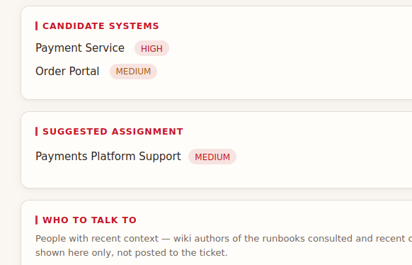

# UI Suggestions
## 1. The style of a vertical line infront of h2 header is misleading for I

### Description
Refer image , some of the heading will look like "I SUGGESTED ASSIGNMENT" .

## Suggestion 
Remove the vertical line in front of the h2 header to avoid confusion and improve readability.
ie; remove the style `.card h2::before` in index.html to make is more readable   