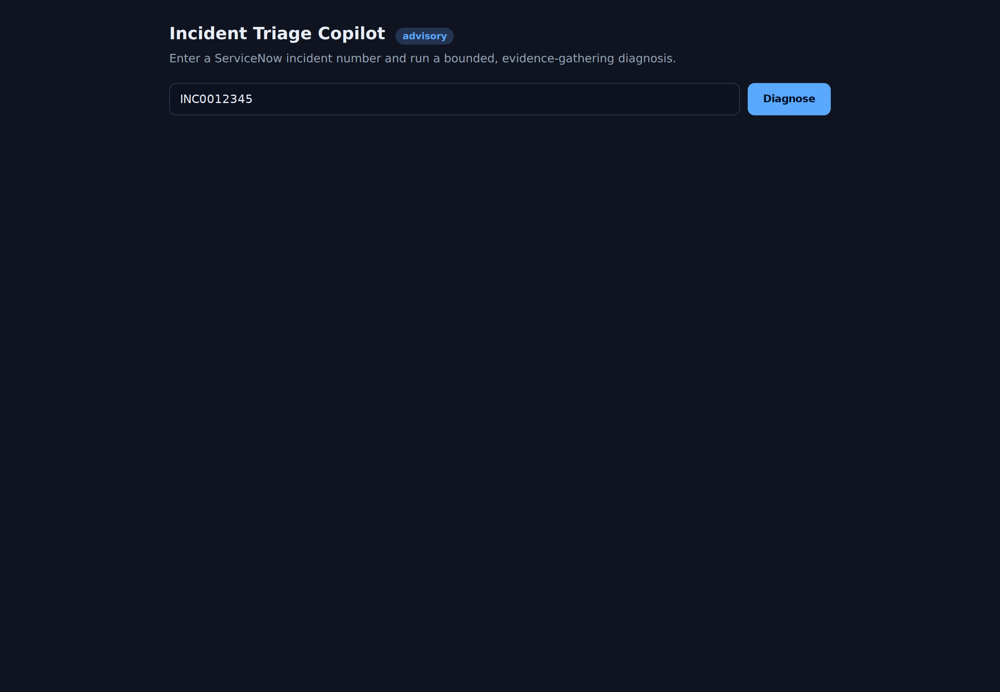
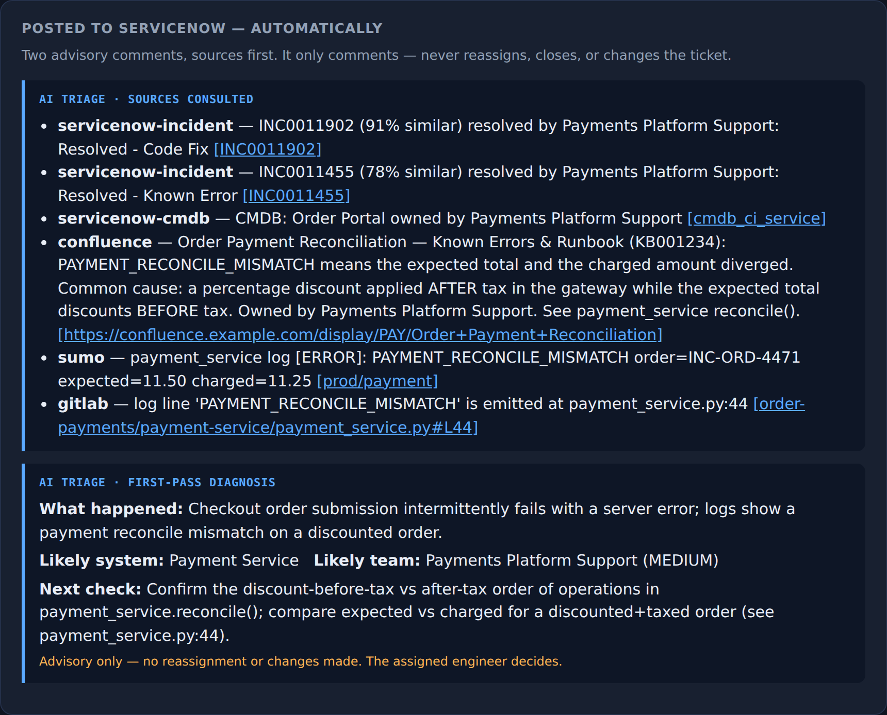
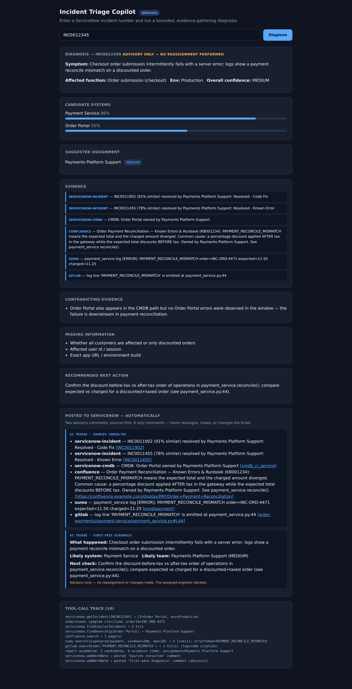

# Demo Walkthrough — Incident Triage Copilot

What the running Spring Boot app does, end to end, and how to run it. Screenshots are
from the real app (`app/`) driven by Playwright against the offline `mock` profile —
no network, no LLM, no external systems.

## Run it

```bash
cd app
mvn spring-boot:run            # needs JDK 21 (a compiler, not just a JRE)
# open http://localhost:8080 → the incident number INC0012345 is pre-filled → Diagnose
```

Verified in-session: `mvn test` → **3/3 pass**, `mvn -Padk test` → **5/5 pass**, app
boots in ~1.3s and serves the full diagnosis end-to-end offline.

## 1 · Trigger

A ServiceNow incident number goes in (manually here; a ServiceNow Business-Rule
webhook can call the same endpoint on ticket creation — no human in the loop).



## 2 · The automatic two-comment write-back (the payoff)

The copilot runs a bounded, evidence-gathering diagnosis and **automatically posts two
advisory comments back to the ticket — sources first, then its view.** It only
comments; it never reassigns, closes, or re-prioritises. Sources go first so the
diagnosis is auditable: every conclusion is one click from the evidence behind it.



- **Comment 1 — Sources consulted**: links to the exact Confluence page (KB001234),
  the Sumo Logic window (`order=INC-ORD-4471`), the GitLab line
  (`payment_service.py:44`), and the two similar resolved incidents.
- **Comment 2 — First-pass diagnosis (advisory)**: what appears to have happened, the
  likely system (Payment Service) and team (Payments Platform Support, medium
  confidence), the next check, and the standing "no reassignment or changes made."

## 3 · Full diagnosis view

The demo UI shows the whole structured report the two comments are rendered from —
clarified symptom, ranked candidate systems with confidence, evidence from all four
systems (including the log↔code citation `payment_service.py:44`), and the tool-call
trace proving it really consulted each source.



## The worked example

The mock dataset (`app/src/main/java/.../gateway/mock/`, reusing the S3′ Sumo fixture
and `seed-repo`) models incident **INC0012345 / order INC-ORD-4471**: discounted
orders fail at checkout because a percentage discount is applied *after* tax in the
gateway while the expected total discounts *before* tax — surfaced as
`PAYMENT_RECONCILE_MISMATCH expected=11.50 charged=11.25`, tied back to
`payment_service.py:44`.

## Regenerating the screenshots

App running on `:8080`, then `node scripts/shot.mjs <out-dir>` (Playwright + chromium)
captures landing / full-page / write-back close-up / mobile. Kept under
`docs/design-java/screenshots/`.
