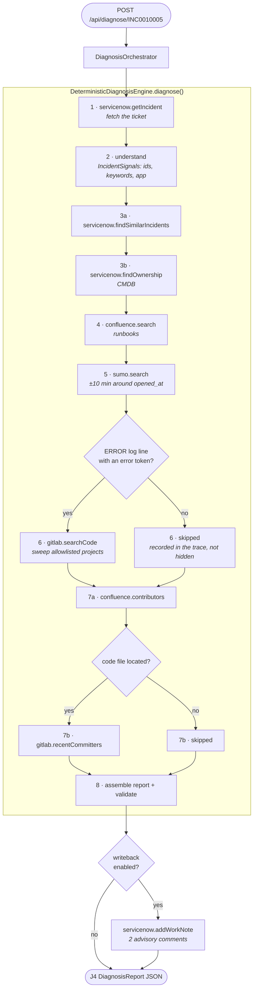

# How TriageMate works — deterministic mode

**Audience:** a developer who has never seen this codebase and wants to understand how a
ServiceNow incident becomes a diagnosis report, without reading the code first.

**Mode:** `triage.engine=deterministic` — the default. No LLM, no network dependency on a
model provider. Runs offline against mock connectors, or against real systems, or any mix.

> **"Deterministic" means predictable, not hardcoded.** Same incident in → same queries out,
> with no model involved. But every query is *derived from the ticket*. Nothing about the
> search terms is fixed in advance.

**The one class that does all of this:**
[`DeterministicDiagnosisEngine.java`](../../src/main/java/com/company/triage/orchestration/DeterministicDiagnosisEngine.java)

---

## The flow at a glance



Every step above also emits a live trace row, which is what the UI renders while the run is
in flight. A **skipped** step still emits a row saying it was skipped and why — the trace must
never claim a call that did not happen, and must never hide a decision either.

---

## Step 1 — which ServiceNow fields we read

One REST call to `/api/now/table/incident`, requesting exactly these fields, plus a second
call to `sys_journal_field` for the ticket conversation (journal entries do not live on the
incident row).

| ServiceNow field | Java field on `IncidentContext` | What it is used for |
|---|---|---|
| `number` | `number` | Identity; excluded from log-search terms |
| `short_description` | `shortDescription` | Keywords, symptom text, app fallback, system-name denylist |
| `description` | `description` | Keywords, identifiers, symptom text |
| `caller_id` | `caller` | Contact suggestion |
| `category` | `category` | `affectedFunction` in the report |
| `subcategory` | `subcategory` | `affectedFunction` in the report |
| `opened_at` | `openedAt` | Centre of the ±10 min log-search window |
| `cmdb_ci` | `configurationItem` | **Primary signal for the affected application** |
| `assignment_group` | `currentAssignment` | System-name denylist for contact extraction |
| `u_environment` | `environment` | Mapped to a log environment code |
| `sys_journal_field` (`comments`) | `comments` | Keywords, identifiers, contacts |
| `sys_journal_field` (`work_notes`) | `workNotes` | Keywords, identifiers, contacts |

Read with `sysparm_display_value=true`, so reference fields come back as readable names
rather than sys_ids.

**Files:**
[`IncidentContext.java`](../../src/main/java/com/company/triage/model/IncidentContext.java) ·
[`RealServiceNowGateway.java`](../../src/main/java/com/company/triage/gateway/real/RealServiceNowGateway.java) ·
[`MockServiceNowGateway.java`](../../src/main/java/com/company/triage/gateway/mock/MockServiceNowGateway.java)

> The ticket itself is always recorded as evidence (`e-incident`). An incident where all four
> other sources come back empty still produces a valid report — "here is what the ticket says
> and nothing corroborated it" is an honest triage outcome.

---

## Step 2 — turning the ticket into search terms

All derivation lives in one place:
[`IncidentSignals.java`](../../src/main/java/com/company/triage/orchestration/IncidentSignals.java)

| Derived value | How | Used by |
|---|---|---|
| **`identifiers`** | Regex over symptom + description + conversation, most specific first: dashed ids (`INC-ORD-4471`), UUIDs, then long hex trace ids. The incident's own number is excluded. | Log query |
| **`keywords`** | Tokens ≥ 4 chars from the same text, function words removed, capped at 8, first-appearance order. Domain words (`error`, `payment`, `order`) are deliberately **kept** — they are what a runbook search needs. | Confluence + log query |
| **`app`** | `cmdb_ci` when set; otherwise the leading name-like phrase of the subject line (up to the first `-`/`:`/`|`, max 4 words). | Confluence query, Sumo scope, GitLab ranking |

Anything this app previously wrote back to the ticket is filtered out of the conversation
text, so re-diagnosing an incident never feeds on its own earlier output.

**Query construction:**

| Query | Rule |
|---|---|
| Confluence | `keywords + app` |
| Sumo | The primary identifier if the ticket has one (most selective); else the top 3 keywords; else `"error"` as a last resort |

---

## Steps 3–7 — when each connector is called

| # | Call | Condition | Notes |
|---|---|---|---|
| 3a | `servicenow.findSimilarIncidents` | **Always** | Keyword match on `short_description` of resolved/closed tickets |
| 3b | `servicenow.findOwnership` | **Always** | CMDB lookup on `cmdb_ci_service` |
| 4 | `confluence.search` | **Always** | One query |
| 5 | `sumo.search` | **Always** | **One** query. Window = `opened_at ± 10 min`, capped by `triage.sumo.max-results` |
| 6 | `gitlab.searchCode` | **Only if** an `ERROR` log line contains an error token | Otherwise a "skipped" trace row is emitted |
| 7a | `confluence.contributors` | Once per page returned in step 4 | Authors/editors |
| 7b | `gitlab.recentCommitters` | **Only if** step 6 located a file | Otherwise a "skipped" row |

### The two conditional branches

**Error token** — the gate for the code search:

```
\b[A-Z][A-Z0-9]*(?:_[A-Z0-9]+)+\b        e.g. PAYMENT_TIMEOUT, ORDER_REJECTED
```

Taken from the **first `ERROR`-level line** in the Sumo results. No token means there is
nothing to search code *for*, so the whole point of the step — tying a log line to the
`file:line` that emits it — cannot happen.

**Sumo scope is composed, not chosen.** The engine does not pick from a list of scopes. It
builds one `_sourceCategory` from a configured pattern:

```
sourceCategoryFor(projectSlug, environment)
   projectSlug  = app, lowercased and hyphenated   ("Delivery Hazards" → delivery-hazards)
   environment  = u_environment mapped to pdev|ptest|stest|vtest|prod, defaulting to prod
```

**GitLab projects are ranked, then swept.** The allowlist is ordered by name overlap with
`app`, then tried in order until one returns a hit. Ranking alone would be a guess, and a
wrong guess silently loses the evidence — the affected system is often *downstream* of the CI
named on the ticket, which is precisely what the diagnosis is supposed to discover.

**Config:** [`application.yml`](../../src/main/resources/application.yml) ·
[`TriageProperties.java`](../../src/main/java/com/company/triage/config/TriageProperties.java)

---

## Step 8 — assembling the report

| Report field | Derived from |
|---|---|
| `candidateSystems` | Loggers that emitted log lines + the CMDB owning application. Confidence: **0.86** log↔code citation · **0.70** ERROR line · **0.45** other log line · **0.55** CMDB only · **0.30** nothing observed |
| `suggestedAssignment` | CMDB support group (MEDIUM) → else the top similar incident's resolution group (LOW) → else unassigned (LOW) |
| `evidence` | Everything actually gathered, each with a stable id (`e-incident`, `e-sim-*`, `e-cmdb`, `e-kb-*`, `e-log`, `e-code`) |
| `suggestedContacts` | Merged across ServiceNow / Confluence / GitLab, ranked by how many **distinct sources** independently named the person |
| `contradictingEvidence` | e.g. the CMDB owner appears nowhere in the searched logs |
| `missingInformation` | Absent correlation id, no matching logs, no runbook, no environment, no comments |
| `recommendedNextAction` | Most specific thing available, falling back through code hit → error token → identifier → reproduce |

Every candidate and assignment may only reference evidence ids that exist in *this* report;
dangling references are filtered out by construction.

The finished report is then run through
[`DiagnosisReportValidator`](../../src/main/java/com/company/triage/model/DiagnosisReportValidator.java),
which enforces the J4 contract (at least one candidate, no dangling evidence refs). For this
engine that is defence in depth — the report is hand-assembled, not model output — so a future
edit that breaks the contract fails loudly here instead of reaching the UI.

**Model classes:**
[`DiagnosisReport`](../../src/main/java/com/company/triage/model/DiagnosisReport.java) ·
[`CandidateSystem`](../../src/main/java/com/company/triage/model/CandidateSystem.java) ·
[`Evidence`](../../src/main/java/com/company/triage/model/Evidence.java) ·
[`Contact`](../../src/main/java/com/company/triage/model/Contact.java)

---

## Where this engine sits

It is registered **unconditionally**, whichever engine is configured, because it is also the
automatic fallback when the ADK engine fails to converge. Having no LLM or network dependency
is exactly what makes it a safe fallback — see [ADK mode](adk-mode.md).

**Entry points:**
[`DiagnosisController`](../../src/main/java/com/company/triage/api/DiagnosisController.java) (manual `POST`) ·
[`IncidentPoller`](../../src/main/java/com/company/triage/orchestration/IncidentPoller.java) (scheduled, off by default) ·
[`DiagnosisOrchestrator`](../../src/main/java/com/company/triage/orchestration/DiagnosisOrchestrator.java) (fallback, timeout, writeback)
